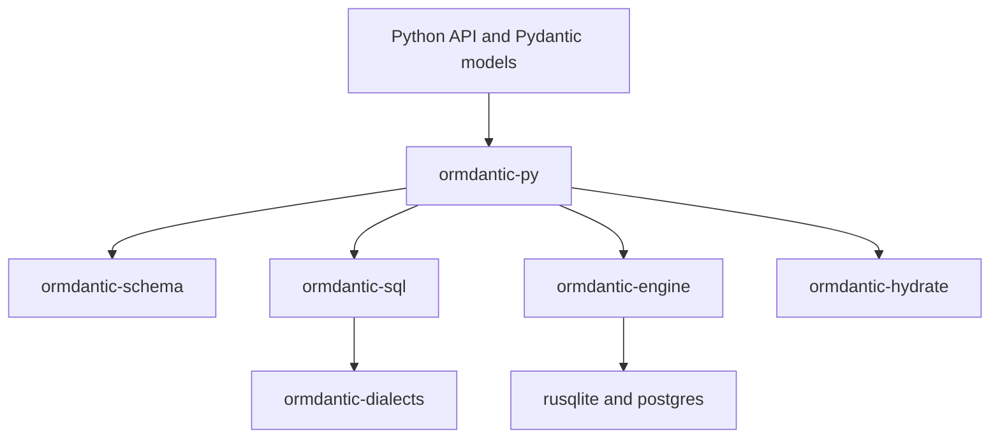

# Rust Core

Ormdantic is split into a thin Python API and Rust crates.

Crates:

- `ormdantic-core`: shared errors and identifiers.
- `ormdantic-schema`: table, field, relationship, and registry metadata.
- `ormdantic-dialects`: quoting, placeholders, and dialect capabilities.
- `ormdantic-sql`: SQL AST, query compilation, and DDL compilation.
- `ormdantic-engine`: native database execution.
- `ormdantic-hydrate`: result shape and row hydration.
- `ormdantic-py`: PyO3 bindings exposed as `ormdantic._ormdantic`.

Python still owns Pydantic model declarations, decorators, and final model construction.
