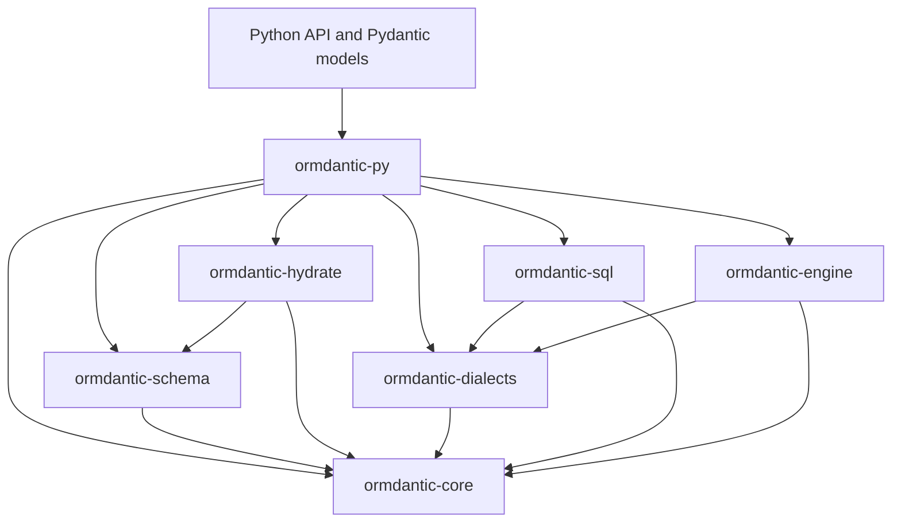

# Rust Core

Ormdantic is split into a thin Python API and a focused Rust workspace. Python keeps the public ORM API and Pydantic integration; Rust owns schema validation, SQL compilation, result-shape planning, and native database execution.

The workspace is defined by the repository-root `Cargo.toml`. Rust crates live under `rust/crates/`, and the Python package build points maturin at `rust/crates/ormdantic-py/Cargo.toml`.

## Crate Responsibilities

| Crate | Responsibility |
| --- | --- |
| `ormdantic-core` | Shared errors, result aliases, typed identifiers, and stable primitives. |
| `ormdantic-schema` | Table definitions, columns, primary keys, indexes, constraints, relationships, and registry validation. |
| `ormdantic-dialects` | Identifier quoting, placeholder style, upsert syntax, returning support, and dialect capability flags. |
| `ormdantic-sql` | SQL AST, filter expressions, CRUD/count/join compilation, bind parameter ordering, and dialect-aware rendering. |
| `ormdantic-hydrate` | Result alias parsing, flat hydration planning, nested result-shape planning, relationship paths, and array paths. |
| `ormdantic-engine` | Native connection handling, driver dispatch, query execution, result values, and transaction primitives. |
| `ormdantic-py` | PyO3 bindings exposed as `ormdantic._ormdantic`, including conversion between Python metadata/values and Rust internals. |

Each crate also has a repository README with its public API summary. Start with the [Rust workspace README](https://github.com/yezz123/ormdantic/tree/main/rust).

## Python Boundary

Python still owns:

- Pydantic model declarations.
- The `@database.table` decorator.
- Relationship discovery from Pydantic annotations.
- The user-facing `Ormdantic`, `Session`, loader, and event APIs.
- Final Pydantic model construction.

Rust owns:

- Schema metadata validation after Python has normalized model metadata.
- Dialect detection from SQLAlchemy-style URLs.
- SQL query and DDL compilation.
- Ordered bind parameter planning.
- Native database execution.
- Result-shape planning and nested row folding.

## Engine Drivers

`ormdantic-engine` is organized by driver modules:

| Driver | Runtime status |
| --- | --- |
| `sqlite` | Full native execution through `rusqlite`. |
| `postgres` | Full native execution through the `postgres` crate. |
| `mysql` | Full native execution through the `mysql` crate. |
| `mariadb` | Full native execution through the MySQL protocol. |
| `mssql` | Full native execution through `tiberius` behind the optional `mssql` feature. |
| `oracle` | Full native execution through `oracle-rs` behind the optional `oracle` feature. |

SQLite, PostgreSQL, and MySQL are enabled by default. MariaDB, SQL Server, Oracle, and `all-engines` builds are feature-gated in `ormdantic-engine`.

## Workspace Rules

- Keep PyO3-specific code in `ormdantic-py`.
- Keep dialect-specific syntax out of generic query planning.
- Keep SQL generation separate from execution.
- Keep Python compatibility behavior in the Python wrapper modules and the PyO3 bridge.
- Avoid exposing Rust struct layout as public Python API.
