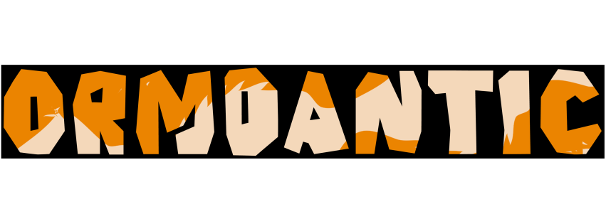

# Ormdantic

<p align="center">
  
</p>

Ormdantic is a Rust-backed asynchronous ORM for Python applications that already use Pydantic models as their data boundary. It lets you turn a Pydantic model into a database table, then use async Python methods for inserts, queries, relationships, sessions, migrations, and reflection.

If you are new, start with [First steps](quickstart.md). If you already know ORMs, use this page to see the shape of the library, then jump to [Concepts](concepts/index.md), [Drivers](drivers/index.md), or the [API reference](api/reference.md).

## The smallest useful example

The smallest useful Ormdantic file can look like this:

```python
from pydantic import BaseModel, Field

from ormdantic import Ormdantic

db = Ormdantic("sqlite:///app.sqlite3")


@db.table(pk="id", indexed=["name"])
class Flavor(BaseModel):
    id: str
    name: str = Field(min_length=2, max_length=80)
    rating: int = 0


async def main() -> None:
    await db.init()
    await db[Flavor].insert(Flavor(id="vanilla", name="Vanilla", rating=5))

    result = await db[Flavor].find_many(
        {"rating": {"gte": 4}},
        order_by=["name"],
    )
    assert [flavor.name for flavor in result.data] == ["Vanilla"]
```

That example does three things:

- `Ormdantic("sqlite:///app.sqlite3")` creates a database registry for one connection
- `@db.table(...)` registers a Pydantic model as a table
- `db[Flavor]` returns a table handle for CRUD and queries

## What Ormdantic gives you

Ormdantic keeps the public API Pythonic and puts repeated runtime work in Rust.

| Need | Ormdantic answer |
| --- | --- |
| One model shape for API and persistence | Pydantic models are the table models. |
| Async CRUD | `insert`, `find_one`, `find_many`, `update`, `upsert`, `delete`, `count`, `select`, and `update_where`. |
| Relationship loading | Explicit `joinedload`, `selectinload`, `lazyload`, and `noload` options. |
| Sessions and transactions | Async contexts for groups of writes that commit or roll back together. |
| Migrations and reflection | Snapshots, diffs, migration files, history, repair, rollback, and live database inspection. |
| Backend-specific control | SQLite, PostgreSQL, MySQL, MariaDB, SQL Server, and Oracle pages document driver behavior. |

## Choose your path

Ormdantic has two main reader paths:

- **New to Ormdantic**: follow [Start here](learning-path.md), then [Installation](installation.md), then [First steps](quickstart.md)
- **Already building an app**: read [Concepts](concepts/index.md) for the mental model, then build the [Todo reference application](tutorial/index.md)
- **Designing production schemas**: read [Drivers](drivers/index.md), [Migrations and reflection](concepts/migrations-and-reflection.md), and the [API reference](api/reference.md)
