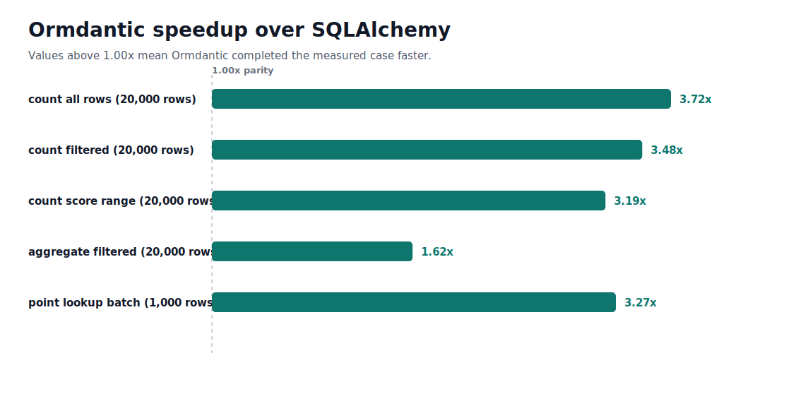
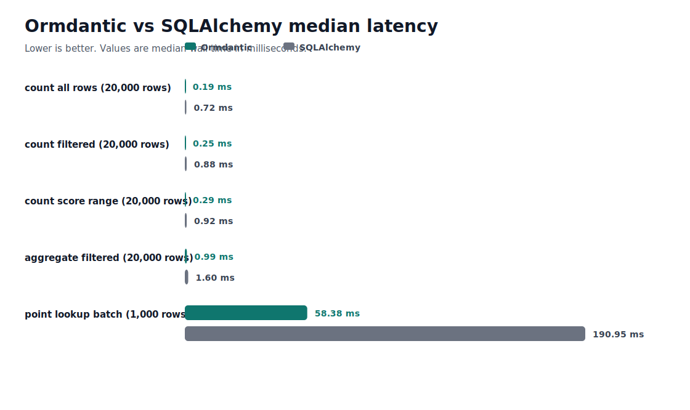

# Performance

Ormdantic's performance strategy is to keep Python ergonomic and move repeated runtime work into Rust.

Use this page when you want to run benchmarks or understand where Ormdantic spends runtime work. It is not a promise that every query is faster than every alternative. Query shape, indexes, network latency, and database behavior still matter.

## What is measured

The benchmark suite covers:

- Python-facing serialization and hydration
- table-handle CRUD
- query-expression paths
- joined and select-in relationship loading
- nested loader graphs
- reflection and migration flows
- Rust SQL and DML compilation
- dialect rendering
- schema diffing
- hydration planning
- select-in merging
- native driver execution

## SQLAlchemy comparison report

The repository also includes a reproducible comparison report under
`benchmark/`. It focuses on native runtime fast paths that both Ormdantic and
SQLAlchemy can run against local SQLite file databases: full-table counts,
filtered counts, score-range counts, aggregate projections, and batched
primary-key lookups.





Regenerate the report and SVGs:

```console
uv run --group dev maturin develop
uv run --group benchmark python -m benchmark.run
```

The command writes JSON, CSV, and SVG outputs under `benchmark/`, plus docs-ready
SVG copies under `docs/assets/benchmarks/`.

## Run Python benchmarks

Run the CodSpeed-enabled Python benchmarks locally:

```console
uv run pytest tests/benchmarks --codspeed
```

The same benchmark tests also work with the local `pytest-benchmark` plugin:

```console
uv run pytest tests/benchmarks
```

## Run Rust benchmarks

Install the CodSpeed cargo subcommand once:

```console
cargo install cargo-codspeed --locked
```

Run Rust benchmarks:

```console
cargo codspeed build
cargo codspeed run
```

Without CodSpeed, use Criterion compatibility locally:

```console
cargo bench --workspace
```

## Read benchmark results

Look for regressions in:

- query compilation
- relationship loading
- hydration
- driver execution
- migration reflection

Small benchmark wins are less important than keeping the Python API predictable and the Rust boundary stable.
