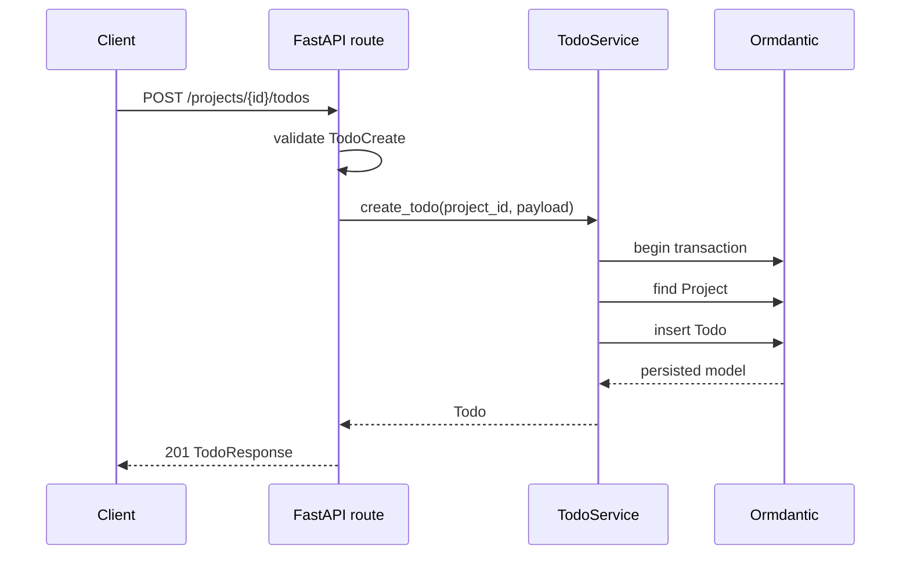

# Implement CRUD and typed queries

This chapter follows a request from FastAPI validation through a transaction and
back into a stable response model.



## Keep persistence behavior in a service

```python
--8<-- "examples/todo_app/app/service.py"
```

The list method composes only the filters supplied by the caller. `column()`
creates typed expressions, `ilike()` performs case-insensitive title matching,
and `selectinload("project")` loads relationships only where the response needs
them. Stable ordering by creation time and identifier prevents pagination from
shuffling equal rows.

Todo creation checks the parent and inserts the child within one transaction.
Any exception rolls the write back. Update uses `exclude_unset=True`, so omitted
PATCH fields keep their stored values while nullable description and due date can
be cleared explicitly.

## Keep HTTP behavior in routes

```python
--8<-- "examples/todo_app/app/routes.py"
```

FastAPI enforces UUID formats, enum values, priority bounds, and pagination bounds
before the service runs. Domain errors remain framework-independent and the app
maps them to stable `404`, `409`, and `503` payloads.

```python
--8<-- "examples/todo_app/app/main.py"
```

Initialization belongs in the lifespan so a failed database connection prevents
the application from reporting ready. `runtime_diagnostics()` supplies only a
safe backend label to the health route.

Continue with [Migrations](migrations.md). For the full query vocabulary, read
[Querying](../concepts/querying.md) and [Query expressions](../api/expressions.md).
