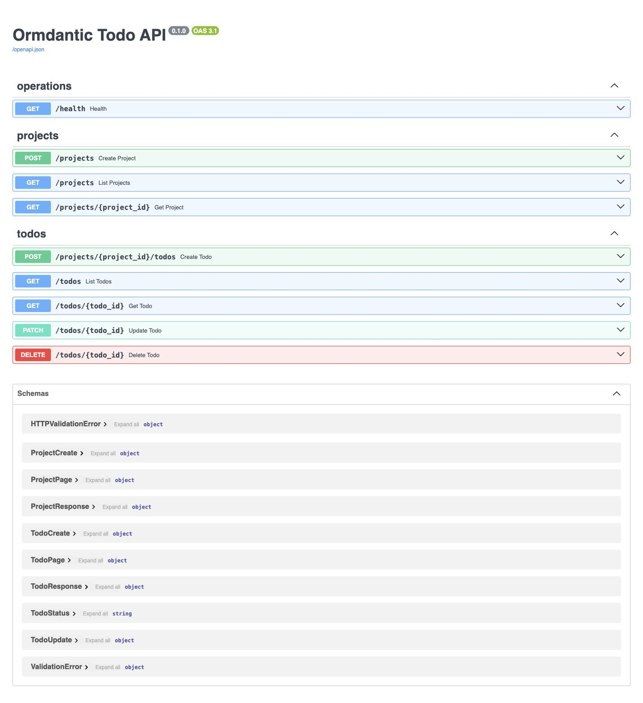
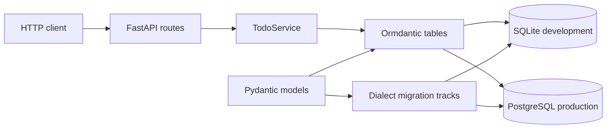

# Build a production-shaped Todo API

This tutorial builds a complete FastAPI application with Ormdantic. You will use
SQLite while developing, review real migration artifacts in the Playground, and
run the same application against PostgreSQL with Docker Compose.

The final application is not a toy script. Configuration, persistence models,
request schemas, services, routes, migrations, and tests have separate modules.
Every source file shown here is executed by the repository test suite.

*The running application exposes health, project, and todo operations through its
generated OpenAPI interface.*

## What you will build

The layers have deliberately narrow jobs:

- `config.py` validates environment variables and redacts database credentials.
- `models.py` declares the persisted Project and Todo tables.
- `schemas.py` owns the HTTP request and response contract.
- `service.py` owns transactions, typed filters, and relationship loading.
- `routes.py` translates HTTP operations into service calls.
- `main.py` initializes Ormdantic in FastAPI's application lifespan.
- `migrations/` contains checked and reversible SQLite and PostgreSQL histories.

## Follow the tutorial

1. [Set up the example](setup.md).
2. [Configure development and production](configuration.md).
3. [Understand the persisted models](models.md).
4. [Build CRUD operations and typed queries](crud-and-queries.md).
5. [Review and run migrations](migrations.md).
6. [Start PostgreSQL with Compose](postgresql.md).
7. [Test the application](testing.md).
8. [Use the production checklist](production-checklist.md).

For the underlying concepts, keep [Database and tables](../concepts/database-and-tables.md),
[Relationships](../concepts/relationships.md), and
[Migrations and reflection](../concepts/migrations-and-reflection.md) nearby.
