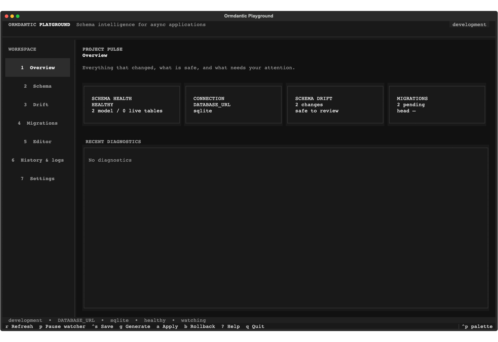
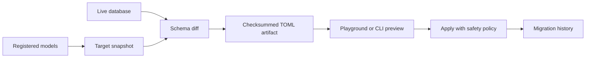

# Review and run migrations

You will apply the real two-revision history, inspect it in the Playground, roll
the additive change back, and reapply it safely.



*The Playground combines schema watching, migration history, safety diagnostics,
and the embedded TOML/SQL editor without bypassing CLI safeguards.*



## Understand the two tracks

Both `migrations/sqlite` and `migrations/postgresql` contain:

1. `0001_create_projects_and_todos`
2. `0002_add_todo_due_date`

The snapshots are equivalent, but the SQL is dialect-specific. PostgreSQL creates
a native enum and drops `due_at` directly. SQLite rebuilds the Todo table during
rollback to preserve its constraints. Never apply an artifact generated for a
different dialect.

## Preview and apply SQLite

From `examples/todo_app`:

```console
ormdantic migrations preview migrations/sqlite/0001_create_projects_and_todos.toml
ormdantic migrations apply-dir migrations/sqlite
ormdantic migrations status
ormdantic migrations history
```

Applying the same directory again is safe: recorded revisions are skipped after
their checksum is verified. If an already-applied file changes, Ormdantic rejects
the mismatch.

## Use the Playground

```console
ormdantic playground
```

Open the migration workspace to inspect source TOML and generated SQL side by
side. The editor validates TOML, limits execution to the selected statement, and
requires destructive review plus the environment's confirmation policy. In
production, safeguards cannot be downgraded from configuration or the UI.

Rollback revision two only on disposable data while learning:

```console
ormdantic migrations rollback \
  migrations/sqlite/0002_add_todo_due_date.toml \
  --allow-destructive
ormdantic migrations apply-dir migrations/sqlite
```

Rollback can destroy data stored in the removed column. Back up production data,
review generated SQL, and test both directions before approval. See
[Migration safeguards](../playground/safety.md) and the
[migration API](../api/migrations.md) for exact behavior.
