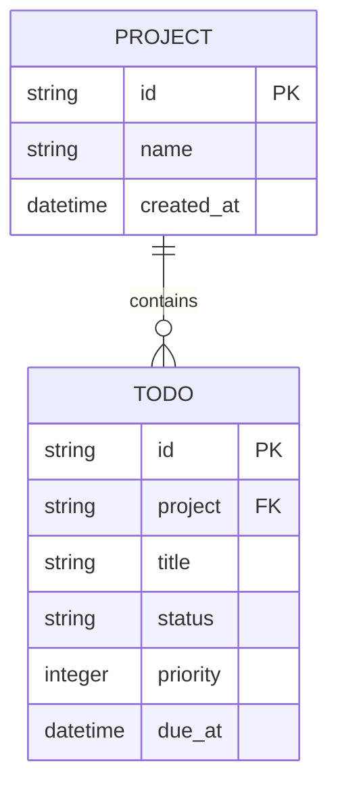

# Model projects and todo items

You will now see how ordinary Pydantic validation becomes table metadata,
constraints, indexes, and a named relationship.



```python
--8<-- "examples/todo_app/app/models.py"
```

Both identifiers are canonical UUID strings. This keeps response shapes identical
between SQLite and PostgreSQL. Time factories produce aware UTC values, and
validators reject naive datetimes before persistence.

`Todo.project` accepts either a shallow Project identifier or a loaded Project.
The `todo_project_fk` constraint uses `ON DELETE CASCADE`; deleting a Project at
the database level removes its Todos. Naming the constraint also makes generated
migration SQL easier to audit.

Pydantic field constraints produce database checks where the driver supports
them. Here they protect name/title lengths, enum values, and the priority range.
Application validation gives clients early feedback, while constraints protect
writes that bypass the API.

The HTTP schemas remain separate:

```python
--8<-- "examples/todo_app/app/schemas.py"
```

This separation prevents persistence-only fields from becoming writable by
accident. PATCH distinguishes omitted values from explicit nulls, and UUID fields
appear as `format: uuid` in OpenAPI.

Read [Field types and metadata](../concepts/field-types-and-metadata.md) for the
complete mapping and [Loading strategies](../concepts/loading-strategies.md) for
relationship behavior.
