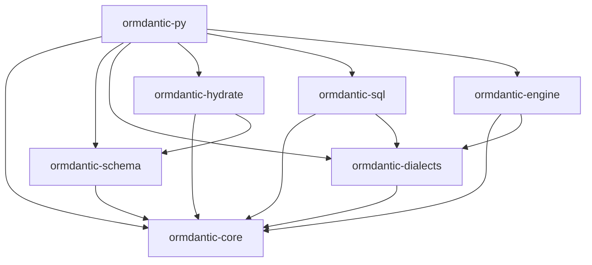

# Ormdantic Rust Workspace

This directory contains the Rust implementation that powers Ormdantic's SQL compilation, schema validation, result hydration, native database execution, and Python extension module.

The Cargo workspace is defined at the repository root in `../Cargo.toml`. Build and test commands should be run from the repository root.

## Crates



| Crate | Role |
| --- | --- |
| `ormdantic-core` | Shared errors, result alias, and typed identifiers. |
| `ormdantic-schema` | Table, column, index, unique constraint, and relationship metadata. |
| `ormdantic-dialects` | Dialect detection, identifier quoting, bind placeholders, and capability flags. |
| `ormdantic-sql` | Query AST and dialect-aware SQL compiler for CRUD, filters, counts, and joins. |
| `ormdantic-hydrate` | Flat and joined result-shape planning for Python model hydration. |
| `ormdantic-engine` | Native database execution and transaction handling. |
| `ormdantic-py` | PyO3 extension module exposed to Python as `ormdantic._ormdantic`. |

## Engine Features

`ormdantic-engine` enables SQLite, PostgreSQL, and MySQL by default:

```toml
default = ["sqlite", "postgres", "mysql"]
```

Additional feature gates are available for MariaDB, SQL Server, Oracle, and a combined `all-engines` build:

| Feature | Purpose |
| --- | --- |
| `sqlite` | SQLite support through `rusqlite`. |
| `postgres` | PostgreSQL support through the `postgres` crate. |
| `mysql` | MySQL support through the `mysql` crate. |
| `mariadb` | MariaDB support through the MySQL protocol. |
| `mssql` | SQL Server runtime through the pure Rust TDS driver. |
| `oracle` | Oracle runtime through the pure Rust TNS driver. |
| `all-engines` | Enables every engine feature. |

## Build And Test

Run these from the repository root:

```bash
cargo build
cargo test
cargo test -p ormdantic-engine --features mssql,oracle
cargo build -p ormdantic-py
```

Database integration tests are gated by environment variables so local and CI runs can opt into external services:

| Variable | Enables |
| --- | --- |
| `ORMDANTIC_POSTGRES_URL` | PostgreSQL execution tests. |
| `ORMDANTIC_MYSQL_URL` | MySQL execution tests. |
| `ORMDANTIC_MARIADB_URL` | MariaDB execution tests. |
| `ORMDANTIC_MSSQL_URL` | SQL Server runtime tests with the `mssql` feature. |
| `ORMDANTIC_ORACLE_URL` | Oracle runtime tests with the `oracle` feature. |

## Python Boundary

Python owns the public ORM API, Pydantic model declarations, decorators, event registration, sessions, and final model construction. Rust owns the compiled SQL, schema validation, result-shape planning, native execution, and the `_ormdantic` bridge used by the Python package.
